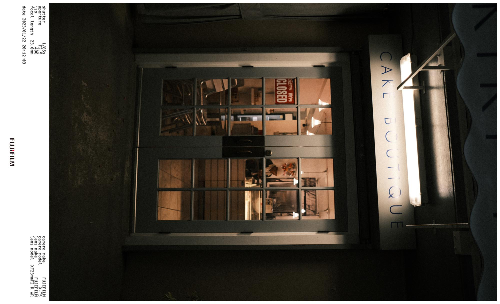

# Dependencies: []

Install pillow package:
```bash
pip install --upgrade Pillow
```
# Usage

```bash
python process.py <directory-name>
```

# Results

Here's the showcase for some of the processed images:




